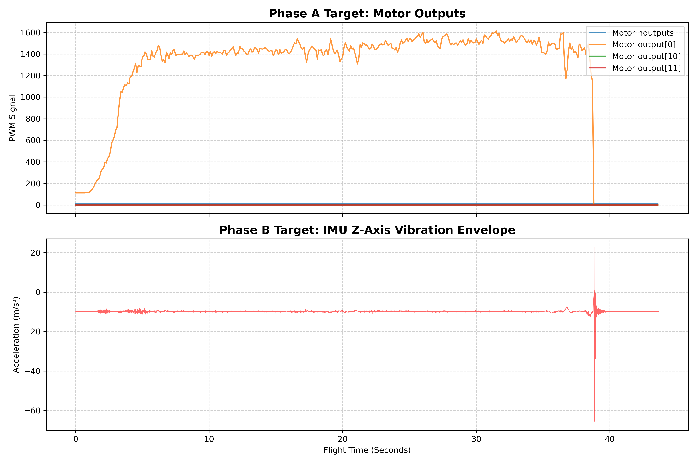

# PX4 Automated Log Diagnostics (Flight Review v2 PoC)

This repository contains the Proof of Concept (PoC) for integrating a hybrid anomaly detection pipeline natively into the new `flight-review-rs` architecture.

### Overview
This project moves away from slow, manual `.ulg` file parsing by natively ingesting the high-speed ZSTD-compressed **Parquet** files generated by the Flight Review v2 Rust backend. By separating the data engineering (Rust) from the data science (Python), we achieve massive performance gains (~113ms conversion and loading times).

### Core Features

**1. High-Frequency Parquet Ingestion**
Natively reads multi-frequency sensor data, utilizing Pandas interpolation (`merge_asof`) to seamlessly sync 250Hz IMU telemetry with 5Hz Local Position data.

**2. Hybrid Detection Pipeline**
* **Phase A (Heuristics):** Deterministic rules to catch explicit hardware failures. The current PoC successfully isolates sudden single-motor PWM failures.
* **Phase B (Machine Learning):** Unsupervised `IsolationForest` models mapping the standard flight envelope to catch severe Z-Axis vibrations and velocity aliasing upon impact.

### Technical Validation
The pipeline successfully ingested raw crash data, synchronized the frequencies, and generated the visualization below. 

It explicitly caught the primary failure mode: **Motor 0 dropping to 0 PWM at 38.5s**, resulting in an immediate **-65 m/s² Z-axis impact**.

### Technical Stack
* **Language:** Python 3.10
* **Data Ingestion:** PyArrow / Pandas (Parquet)
* **ML Model:** Scikit-Learn Isolation Forest
* **Backend Target:** `flight-review-rs` (Dronecode Foundation)
