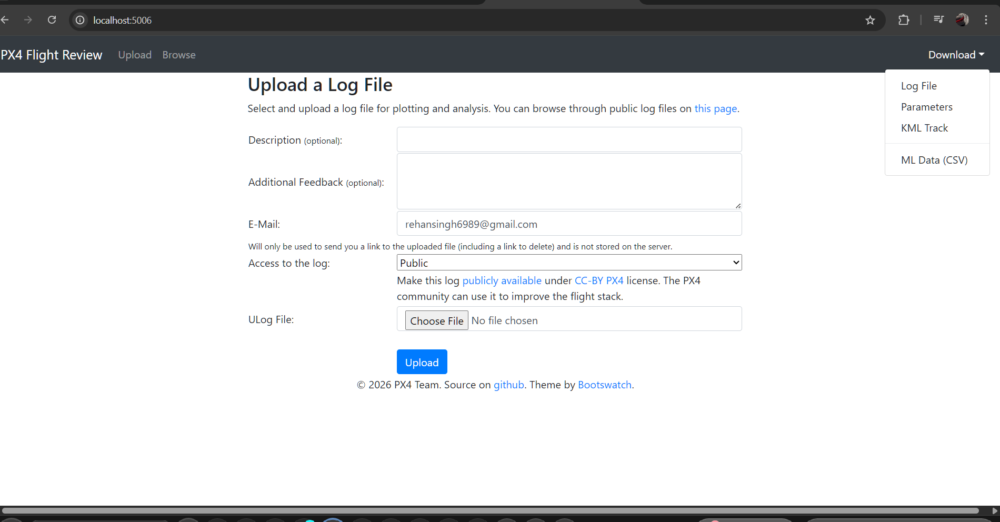
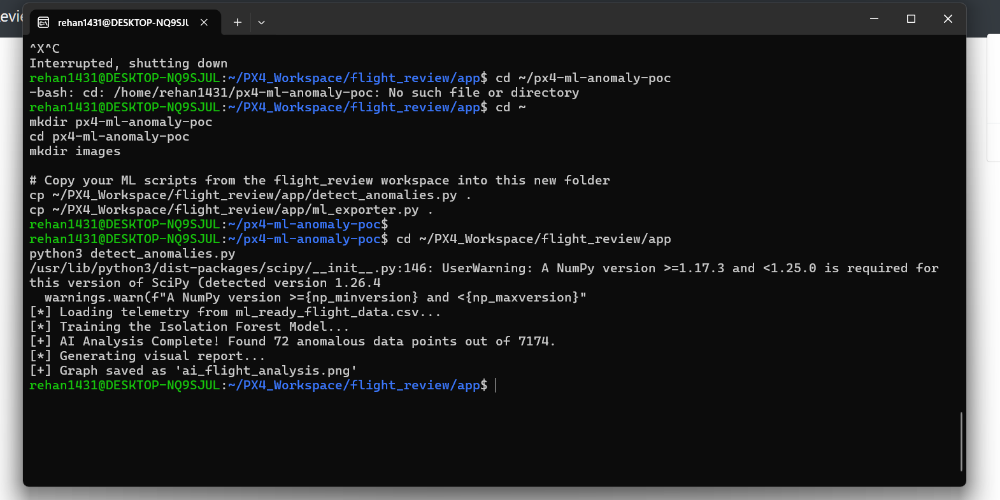
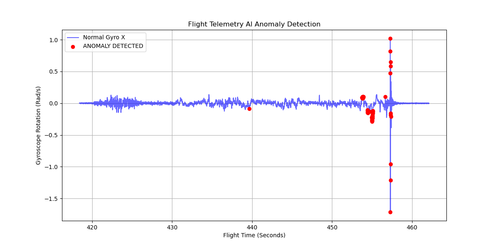

# PX4 AI-Assisted Log Diagnosis (PoC)

This repository contains a Proof of Concept (PoC) for integrating unsupervised Machine Learning anomaly detection into the [PX4 Flight Review](https://github.com/PX4/flight_review) ecosystem.

## Overview
The goal is to move beyond manual log inspection by using an **Isolation Forest** model to automatically flag catastrophic flight anomalies in high-frequency ULog telemetry.

### 1. Native UI Integration
The Flight Review frontend is modified to include a "ML Data (CSV)" export option, allowing users to trigger the ML pipeline directly from the browser.

### 2. High-Frequency Data Processing
The backend extracts raw `gyro_rad` data, normalizing thousands of rows of telemetry for model inference. 

### 3. AI Anomaly Detection Results
The model successfully ignores standard flight vibrations and isolates significant deviations (red dots) that indicate mechanical failure or sensor clipping.

## Technical Stack
* **Language:** Python 3.10
* **ML Model:** Scikit-Learn Isolation Forest (Unsupervised)
* **Backend:** Tornado / Bokeh (PX4 Flight Review stack)
* **Data:** ULog telemetry conversion to Pandas DataFrames
